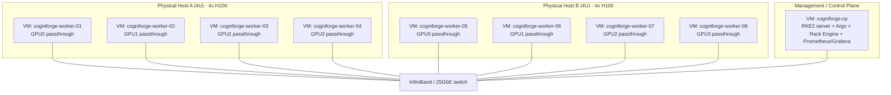

# Rack Layout - Virtual Machine GPU Cluster

> The document `rack-layout.pdf` in the original build package is replaced by
> this Markdown file with an embedded Mermaid diagram. Render it with any
> Mermaid-capable viewer (VS Code, mermaid.live, GitHub) or convert to PDF.

## Topology

Two physical hosts each carry four H100 GPUs. Eight GPU worker VMs are created
with Vagrant + libvirt; each worker is assigned exactly one physical GPU via
PCI passthrough (`vfio-pci`). A lightweight control-plane VM runs RKE2 server,
Argo Workflows, the Rack Engine API and the monitoring stack.

## IP / VLAN plan

- Management network: `192.168.1.0/24` (VM management NICs, libvirt bridge)
- InfiniBand / high-speed fabric: `10.0.0.0/24` (physical host IB; VMs use
  bridged virtio NICs on the host fabric)
- Storage: local NVMe on each host exposed via `local-nvme` StorageClass

## GPU assignment (host A)

| VM | PCI BDF | GPU UUID (example) |
|----|---------|--------------------|
| cogniforge-worker-01 | `0000:31:00.0` | GPU-aaaa1111 |
| cogniforge-worker-02 | `0000:32:00.0` | GPU-bbbb2222 |
| cogniforge-worker-03 | `0000:33:00.0` | GPU-cccc3333 |
| cogniforge-worker-04 | `0000:34:00.0` | GPU-dddd4444 |

Discover the real BDFs with `lspci -nn | grep -i nvidia` before configuring
`/etc/modprobe.d/vfio.conf` (see [provisioning/gpu-passthrough.md](../provisioning/gpu-passthrough.md)).
